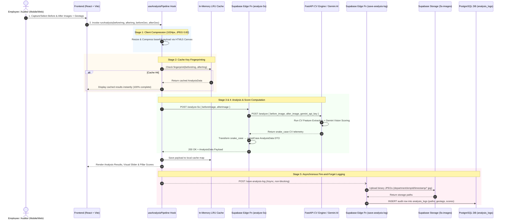

# ARCOLAB 5S Comparison Analysis Pipeline — Technical Architecture & End-to-End Data Flow Report

This document provides a comprehensive technical breakdown of the **Before/After Image Comparison Analysis Pipeline** in the **ARCOLAB 5S Insight** application. It details every execution stage—from mobile field image capture and client-side optimization to serverless edge proxying, computer vision & Gemini AI scoring, and asynchronous audit logging.

---

## 📌 Executive Summary

The **5S Comparison Analysis Pipeline** is an automated auditing workflow designed to measure, evaluate, and track workplace compliance according to the 5S Lean methodology (**Sort, Set in Order, Shine, Standardize, Sustain**) and Lean Maintenance standards.

Auditors capture or upload paired images:
1. **Before Image**: The baseline/initial state of a laboratory, office, or production workstation.
2. **After Image**: The operational/cleaned state following a 5S audit or corrective maintenance action.

The pipeline processes these image pairs through client-side optimization, a serverless Deno Edge proxy, a deterministic Python FastAPI Computer Vision engine, and Google Gemini AI vision models to produce instant quantitative scores, metric deltas, score driver analysis, and corrective recommendations.

---

## 📊 End-to-End Architecture & Data Flow Diagram



---

## ⚙️ Detailed Stage-by-Stage Pipeline Breakdown

### 1️⃣ Stage 1: Field Capture & Image Acquisition
* **Components**: `ImageUploader.tsx`, `navigator.mediaDevices.getUserMedia`
* **Workflow**:
  * Auditors access live camera feeds on mobile or desktop devices.
  * Real-time metadata (**GeoMeta**) is collected simultaneously:
    * GPS Coordinates (`latitude`, `longitude`)
    * Office Location & Designated Zone/Department
    * Timestamp of capture (`capturedAt`)
    * Auditor Employee Credentials (`employeeId`, `employeeName`)
  * The user pairs a **Before Image** and an **After Image**.

---

### 2️⃣ Stage 2: Client-side Image Optimization & Cache Keying
* **Component**: [`useAnalysisPipeline.ts`](file:///c:/Users/Vijay%20Ramesh/5s%20comparison/Arcolab/frontend/src/hooks/useAnalysisPipeline.ts)
* **Canvas Image Compression**:
  * Both high-resolution images are resized on an HTML5 `<canvas>` element to a maximum dimension of `1024px` while preserving aspect ratios.
  * Output format is encoded as `image/jpeg` at quality `0.82`. This reduces network payload size by **70–85%**, preventing bandwidth bottlenecks.
* **LRU Cache Check**:
  * A string fingerprint is calculated by hashing structural slices of the base64 strings:
    $$\text{Fingerprint} = \text{Slice}_{\text{before}} + \text{"[VS]"} + \text{Slice}_{\text{after}}$$
  * If an identical image pair was previously analyzed in the session, the pipeline loads results instantly from an in-memory `Map` (capacity max 10 entries) without making network calls.

---

### 3️⃣ Stage 3: Serverless Edge Proxying & Resilience Strategy
* **Component**: [`backend/supabase/functions/analyze-5s/index.ts`](file:///c:/Users/Vijay%20Ramesh/5s%20comparison/Arcolab/backend/supabase/functions/analyze-5s/index.ts)
* **Edge Service Layer**:
  * Deno serverless function handles CORS validation and extracts base64 payloads.
  * **Dev Mode Direct Dispatch**: In local development, the hook can route directly to `http://localhost:8000/analyze`.
  * **Production Tunnel Dispatch**: Proxies the payload to the external Python FastAPI Computer Vision Engine (`CV_ENGINE_URL`).
* **Retry & Exponential Backoff**:
  * The client hook implements `invokeWithRetry` with `MAX_RETRIES = 2` and incremental backoff delays (`1500ms * (attempt + 1)`).
  * If the CV engine returns HTTP `503` (engine offline), a structured fallback alert is propagated cleanly to the UI.

---

### 4️⃣ Stage 4: Computer Vision & AI Vision Scoring Engine
* **Components**: [`cv/main.py`](file:///c:/Users/Vijay%20Ramesh/5s%20comparison/Arcolab/cv/main.py), [`gemini/`](file:///c:/Users/Vijay%20Ramesh/5s%20comparison/Arcolab/gemini)
* **Scoring Methodology**:
  * Evaluates each of the 5 pillars on a scale of **0–20** points (transformed to **0–100%** for display):
    * **Sort (*Seiri*)**: Surface clutter ratio, unneeded tools on desk.
    * **Set in Order (*Seiton*)**: Tool alignment, shadow board indexing, clear pathways.
    * **Shine (*Seiso*)**: Surface cleanliness, absence of dust/stains.
    * **Standardize (*Seiketsu*)**: Color coding, standard label visibility.
    * **Sustain (*Shitsuke*)**: Overall compliance discipline & safety readiness.
  * **Score Drivers**: Identifies specific factors (e.g., *"+18% floor clutter reduction"*) causing score deltas.
  * **Transformation**: The edge function maps snake_case CV telemetry (`before_scores`, `score_drivers`) into camelCase TypeScript DTOs (`beforeScores`, `scoreDrivers`).

---

### 5️⃣ Stage 5: Asynchronous "Fire-and-Forget" Audit Logging
* **Component**: [`backend/supabase/functions/save-analysis-log/index.ts`](file:///c:/Users/Vijay%20Ramesh/5s%20comparison/Arcolab/backend/supabase/functions/save-analysis-log/index.ts)
* **Non-Blocking Execution**:
  * Once the analysis results arrive at the client, the UI **immediately renders** the scores to the user without waiting for database writes.
  * In the background, `supabase.functions.invoke("save-analysis-log")` is launched asynchronously.
* **Storage Flywheel (`5s-images` Bucket)**:
  * Converts base64 image strings to binary JPEG byte streams.
  * Saves images into Supabase Storage with structured paths:
    $$\text{Path} = \text{department} / \text{employeeId} / \text{timestamp} / \{\text{before.jpg}, \text{after.jpg}\}$$
* **PostgreSQL Audit Log Persistence**:
  * Inserts a record into the `public.analysis_logs` table containing:
    * `employee_id`, `employee_name`, `department`, `office_name`
    * `before_image_path`, `after_image_path` (storing storage URIs, **never base64 blobs**)
    * `before_latitude`, `before_longitude`, `after_latitude`, `after_longitude`, `captured_at`
    * Full `analysis_result` JSON object and raw `cv_metrics`.

---

## 🛠️ Data Schemas & Payload Models

### Analysis Result DTO (`AnalysisData`)

```typescript
export interface AnalysisData {
  overview: string;
  scoringMethod: string;
  rawScoringMethod?: string;
  beforeScores: {
    sort: number;         // 0 - 100%
    setInOrder: number;
    shine: number;
    standardize: number;
    sustain: number;
  };
  afterScores: {
    sort: number;
    setInOrder: number;
    shine: number;
    standardize: number;
    sustain: number;
  };
  beforeExplanations: Record<string, string>;
  afterExplanations: Record<string, string>;
  recommendations: string[];
  improvements: string[];
  rootCauseObservations?: string[];
  safetyRecommendations?: string[];
  leanMaintenanceScore: number;
  leanMaintenanceScoreAfter: number;
  leanMaintenanceExplanation: string;
  scoreDrivers?: {
    [key in 'sort' | 'setInOrder' | 'shine' | 'standardize' | 'sustain']?: {
      primaryMetric: string;
      primaryValue: number;
      impact: 'positive' | 'negative';
      note: string;
    };
  };
}
```

### Relational Database Schema (`public.analysis_logs`)

```sql
CREATE TABLE public.analysis_logs (
    id UUID PRIMARY KEY DEFAULT gen_random_uuid(),
    employee_id TEXT NOT NULL,
    employee_name TEXT,
    department TEXT,
    office_name TEXT,
    before_image_path TEXT,
    after_image_path TEXT,
    analysis_result JSONB NOT NULL,
    scoring_method TEXT DEFAULT 'CV Engine',
    cv_metrics JSONB,
    before_latitude DOUBLE PRECISION,
    before_longitude DOUBLE PRECISION,
    before_captured_at TIMESTAMPTZ,
    after_latitude DOUBLE PRECISION,
    after_longitude DOUBLE PRECISION,
    after_captured_at TIMESTAMPTZ,
    captured_at TIMESTAMPTZ DEFAULT now(),
    upload_status TEXT DEFAULT 'uploaded',
    created_at TIMESTAMPTZ DEFAULT now()
);
```

---

## 💡 Key Architectural Benefits

1. **Low Latency & Fast UX**: Client-side canvas compression reduces network transfer sizes, while in-memory LRU caching makes repeated image checks instant.
2. **Non-Blocking Audit Persistence**: Using fire-and-forget edge invocations ensures database or storage write delays never freeze the UI.
3. **Storage & DB Efficiency**: Purges heavy base64 strings from relational tables, persisting clean binary JPEG files in object storage buckets and storing file paths in PostgreSQL.
4. **Reliability & Resilience**: Multi-stage retry logic handles transient network failures gracefully with clear error boundaries.
