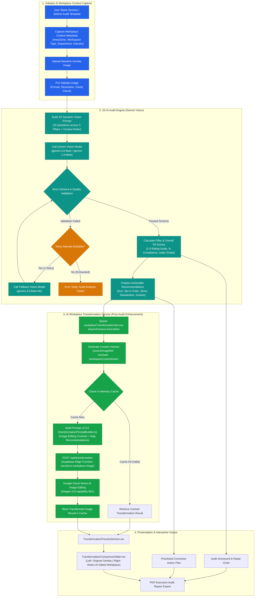
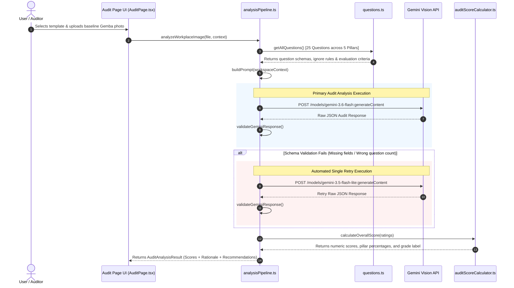

# ARCOLAB – Vertex AI Image Transformation Service
## Production Architecture & Implementation Specification

This document provides a comprehensive technical overview, system flowcharts, sequence diagrams, and module interaction specifications for the **ARCOLAB 5S Audit System** and the **Vertex AI Image Transformation Service**.

---

## 1. End-to-End System Overview Flowchart



---

## 2. Phase 1: 5S AI Audit Pipeline (Detailed Technical Flow)

### Sequence Diagram



---

## 3. Phase 2: Vertex AI Image Transformation Service

The **Post-Audit Enhancement Service** (`workplaceTransformationService.ts`) runs asynchronously after audit scoring completes. **Key Contract**: *It never alters baseline scores, ratings, or audit recommendations.*

### Edge Function Backend Contract (`transform-workplace-image/index.ts`)

- **Location**: `supabase/functions/transform-workplace-image/index.ts`
- **Method**: `POST /transform-workplace-image`
- **Input**:
  ```json
  {
    "sourceImage": "data:image/jpeg;base64,...",
    "auditId": "session_123",
    "context": { "areaName": "Assembly", "industry": "Manufacturing" },
    "recommendations": [ ... ],
    "prompt": "Edit the uploaded workplace image..."
  }
  ```
- **Output (Success)**:
  ```json
  {
    "status": "complete",
    "imageUrl": "data:image/jpeg;base64,...",
    "metadata": {
      "auditId": "session_123",
      "transformationId": "tr_edge_...",
      "imageModel": "imagen-3.0-capability-001",
      "generationStatus": "complete"
    }
  }
  ```

---

## 4. Key Architectural Safeguards & Comparison Matrix

| Feature / Aspect | 5S AI Audit Engine | AI Workplace Transformation Preview |
| :--- | :--- | :--- |
| **Execution Trigger** | Synchronous during audit run | Asynchronous post-audit enhancement |
| **Primary Responsibility** | Evaluates baseline workplace state & calculates scores | Conceptual visual forecast of post-implementation state |
| **Integrity Contract** | Dictates ratings, score cards, and recommendations | Strictly read-only relative to scoring; zero impact on grade |
| **Caching Strategy** | Session-bound audit results | Hash-based invalidation (`sourceImageRef` + `recHash` + `ctxHash`) |
| **Security Architecture** | Client API key or Edge Function | Backend API / Supabase Edge Function with Vertex AI credentials |
| **Visual Output** | Annotated pillar cards, radar chart, action list | Photorealistic visual preview with interactive comparison slider |
| **Image Identity Preservation**| Evaluates uploaded Gemba photo | Preserves 100% camera angle, room geometry, walls, and machinery |
| **Failure Handling** | Single model retry on schema validation failure | Displays explicit "Transformation Preview Unavailable" card with Retry button |

---

## 5. Primary Source File Reference

- **Audit Execution Page**: [`src/modules/audit/pages/AuditPage.tsx`](file:///c:/Users/Vijay%20Ramesh/5S/basics/frontend/src/modules/audit/pages/AuditPage.tsx)
- **AI Audit Analysis Pipeline**: [`src/modules/audit/pipeline/analysisPipeline.ts`](file:///c:/Users/Vijay%20Ramesh/5S/basics/frontend/src/modules/audit/pipeline/analysisPipeline.ts)
- **Questionnaire & Guidance Schema**: [`src/modules/audit/pipeline/questions.ts`](file:///c:/Users/Vijay%20Ramesh/5S/basics/frontend/src/modules/audit/pipeline/questions.ts)
- **Score Calculation Engine**: [`src/modules/audit/services/auditScoreCalculator.ts`](file:///c:/Users/Vijay%20Ramesh/5S/basics/frontend/src/modules/audit/services/auditScoreCalculator.ts)
- **Workplace Transformation Service**: [`src/modules/audit/services/workplaceTransformationService.ts`](file:///c:/Users/Vijay%20Ramesh/5S/basics/frontend/src/modules/audit/services/workplaceTransformationService.ts)
- **Transformation Prompt Builder**: [`src/modules/audit/services/transformationPromptBuilder.ts`](file:///c:/Users/Vijay%20Ramesh/5S/basics/frontend/src/modules/audit/services/transformationPromptBuilder.ts)
- **Backend Edge Function Service**: [`supabase/functions/transform-workplace-image/index.ts`](file:///c:/Users/Vijay%20Ramesh/5S/basics/supabase/functions/transform-workplace-image/index.ts)
- **Interactive UI Preview Section**: [`src/modules/audit/components/TransformationPreviewSection.tsx`](file:///c:/Users/Vijay%20Ramesh/5S/basics/frontend/src/modules/audit/components/TransformationPreviewSection.tsx)
- **Interactive Comparison Slider**: [`src/modules/audit/components/TransformationComparisonSlider.tsx`](file:///c:/Users/Vijay%20Ramesh/5S/basics/frontend/src/modules/audit/components/TransformationComparisonSlider.tsx)
