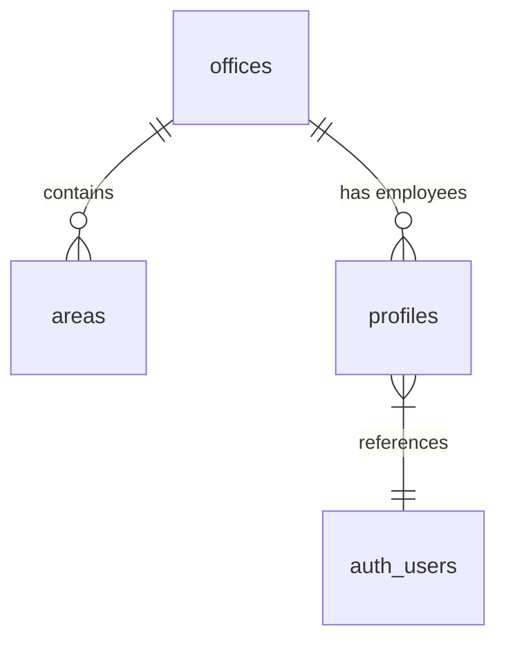
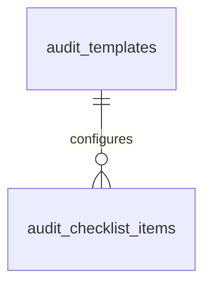
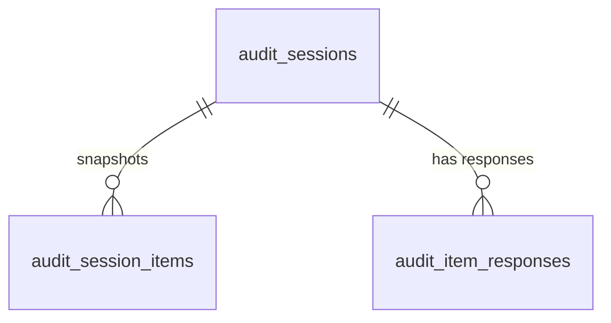
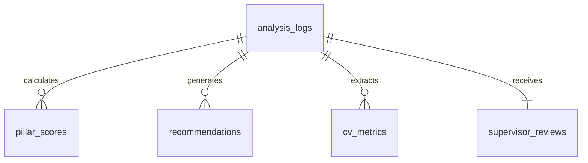

# Supabase Database Schema Sketch (Basics)

This sketch details the tables, relations, and purposes in the new Supabase database. The schema supports two main audit workflows: **Interactive Checklist Audits** and **AI-Powered Photo Audits**.

---

## 🏛️ Domain 1: Master Organizational Entities

These tables represent the organizational structure and user identities.

### 1. `offices`
- **Purpose**: Defines company office sites/locations.
- **Fields**:
  - `id` (UUID PRIMARY KEY)
  - `name` (TEXT UNIQUE)
  - `city` (TEXT)
  - `country` (TEXT)
  - `created_at` (TIMESTAMP)

### 2. `areas`
- **Purpose**: Defines departments or workstations in an office.
- **Fields**:
  - `id` (UUID PRIMARY KEY)
  - `office_id` (UUID REFERENCES offices)
  - `name` (TEXT)
  - `created_at` (TIMESTAMP)

### 3. `profiles`
- **Purpose**: Linked user account metadata. Synchronized with `auth.users` via database triggers.
- **Fields**:
  - `id` (UUID PRIMARY KEY REFERENCES auth.users)
  - `first_name` (TEXT)
  - `last_name` (TEXT)
  - `email` (TEXT UNIQUE)
  - `role` (ENUM: worker, supervisor, admin)
  - `employee_code` (TEXT UNIQUE)
  - `office_id` (UUID REFERENCES offices)
  - `created_at` / `updated_at` (TIMESTAMP)

---

## 📋 Domain 2: Checklist Templates (Static Configuration)

These tables specify static questions and settings for standard 5S checklists.

### 4. `audit_templates`
- **Purpose**: Holds predefined checklists (e.g. Assembly Line Audit).
- **Fields**:
  - `id` (UUID PRIMARY KEY)
  - `name` (TEXT)
  - `description` (TEXT)
  - `version` (TEXT)
  - `status` (TEXT: ACTIVE, INACTIVE)
  - `is_default` (BOOLEAN)
  - `industry` / `department` / `workspace_type` (TEXT)

### 5. `audit_checklist_items`
- **Purpose**: Contains the static checklist questions mapped to a template.
- **Fields**:
  - `id` (UUID PRIMARY KEY)
  - `template_id` (UUID REFERENCES audit_templates)
  - `pillar` (TEXT: Sort, Set in Order, etc.)
  - `question_id` (TEXT)
  - `question_text` (TEXT)
  - `max_points` / `weight` / `display_order` (INTEGER)
  - `is_mandatory` (BOOLEAN)
  - `severity` (TEXT)
  - `category` (TEXT)

---

## ⚡ Domain 3: Interactive Checklist Audits (Sessions & Responses)

Tracks active audit checklists done manually or with partial AI assist.

### 6. `audit_sessions`
- **Purpose**: An individual checklist audit session.
- **Fields**:
  - `id` (UUID PRIMARY KEY)
  - `template_id` (UUID REFERENCES audit_templates)
  - `status` (TEXT: IN_PROGRESS, COMPLETED)
  - `overall_score_before` / `overall_score_after` (INTEGER)
  - `percentage` / `grade` (TEXT)
  - `before_image_path` / `after_image_path` (TEXT)

### 7. `audit_session_items`
- **Purpose**: Snapshot of the template questions at the start of a session.
- **Fields**:
  - `id` (UUID PRIMARY KEY)
  - `audit_session_id` (UUID REFERENCES audit_sessions)
  - `question_text` (TEXT)
  - `pillar` (TEXT)

### 8. `audit_item_responses`
- **Purpose**: Holds responses to the questions in an audit session.
- **Fields**:
  - `id` (UUID PRIMARY KEY)
  - `audit_session_id` (UUID REFERENCES audit_sessions)
  - `question_id` (TEXT)
  - `ai_answer` (TEXT: YES, NO, PARTIAL)
  - `confidence` (NUMERIC)
  - `evidence` (TEXT)
  - `score` (INTEGER)

---

## 🤖 Domain 4: AI-Powered Photo Audits & Computer Vision Insights

Created when a user runs a photo-based analysis. Trigger logic synchronizes parsed JSON results to the detailed normalized child tables.

### 9. `analysis_logs`
- **Purpose**: Logs photo analysis events, capturing raw JSON results and images.
- **Fields**:
  - `id` (UUID PRIMARY KEY)
  - `worker_id` (UUID REFERENCES profiles)
  - `area_id` (UUID REFERENCES areas)
  - `before_image_path` / `after_image_path` (TEXT)
  - `analysis_result` (JSONB raw Gemini V2 payload)
  - `overall_score_before` / `overall_score_after` (INTEGER)
  - `lean_maintenance_score` (INTEGER)

### 10. `pillar_scores`
- **Purpose**: Extracted 5S pillar scores (Sort, Set in Order, etc.).
- **Fields**:
  - `id` (UUID PRIMARY KEY)
  - `analysis_log_id` (UUID REFERENCES analysis_logs)
  - `pillar` (five_s_pillar ENUM)
  - `score_before` / `score_after` (INTEGER)
  - `explanation_before` / `explanation_after` (TEXT)

### 11. `recommendations`
- **Purpose**: AI-generated action items (e.g. safety warning details, Kaizen suggestions).
- **Fields**:
  - `id` (UUID PRIMARY KEY)
  - `analysis_log_id` (UUID REFERENCES analysis_logs)
  - `category` (recommendation_category ENUM: safety, root_cause, general)
  - `description` (TEXT)
  - `status` (recommendation_status ENUM: pending, completed)
  - `assigned_to` (UUID REFERENCES profiles)
  - `due_date` (DATE)

### 12. `cv_metrics`
- **Purpose**: Raw computer-vision numbers (clutter density, texture, symmetry, alignment metrics).
- **Fields**:
  - `id` (UUID PRIMARY KEY)
  - `analysis_log_id` (UUID REFERENCES analysis_logs)
  - `state` (before, after)
  - `clutter_count` / `clutter_density` / `obstruction_ratio` / `spacing_consistency`

### 13. `supervisor_reviews`
- **Purpose**: Optional human supervisor verification review.
- **Fields**:
  - `id` (UUID PRIMARY KEY)
  - `analysis_log_id` (UUID REFERENCES analysis_logs UNIQUE)
  - `supervisor_id` (UUID REFERENCES profiles)
  - `rating` (INTEGER 1-5)
  - `notes` (TEXT)

---

## 🗑️ Redundancies & Unused Tables (Tier 2/3 Rule Engine)
- `audit_prompt_versions`
- `audit_critical_rules`
- `audit_custom_rules`

**Status**: Kept in the schema for compatibility.
**Reason**: While our **AI Scoring Pipeline V2** executes questions and guidances entirely client-side/Edge-side via `questions.ts` for speed and consistency, these tables are bound to database-level triggers and RLS policies. Removing them would require modifying the cascade constraints of other core tables. Keeping them ensures full compatibility for any future administrative interface.
